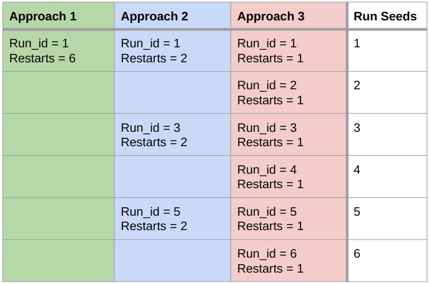

# Active Learning Benchmark

## Reading List
- [Munjal_Towards_Robust_and_Reproducible_Active_Learning](https://openaccess.thecvf.com/content/CVPR2022/papers/Munjal_Towards_Robust_and_Reproducible_Active_Learning_Using_Neural_Networks_CVPR_2022_paper.pdf)
- [A Comparative Survey of Deep Active Learning](https://arxiv.org/pdf/2203.13450.pdf)
- [Randomness is the Root of All Evil](https://openaccess.thecvf.com/content/WACV2023/papers/Ji_Randomness_Is_the_Root_of_All_Evil_More_Reliable_Evaluation_WACV_2023_paper.pdf)

## Version 2.0
- from-scratch or finetuning? (finetuning has less variance)
  - Might as well use xgboost
- include batch-AL: each dataset supports a range of batch-sizes - we can use lager image datasets
- set sample-size: Maybe by RAM usage?
- Revise the evaluation: Is the "sets of experiments" protocol from the CD-diagram what we need?
- Show that other benchmarks are not consistent

## Dependencies
Python >= 3.10 

Via pip:
- torch
- torchvision
- gym
- matplotlib
- Pandas
- scikit-learn
- faiss-cpu
- nltk (additional download for `nltk.word_tokenize` in News/TopV2 needed)
- PyYAML
- batchbald-redux
- ray\[tune\] (Optional)

## Quick Start
[Optional] Pre-download all datasets `download_all_datasets.py --data_folder <your_folder>`\
`--data_folder` sets the folder, where dataset files will be downloaded to \
You can run an evaluation with `evaluate.py --data_folder "<my_folder>" --agent <name> --dataset <name> --query_size <int>`\
Available Agents:
- `random`
- `margin`
- `entropy`
- `coreset` (CoreSet Greedy)
- `typiclust`
- `bald`
- `badge`
- `coregcn`
- `dsa`
- `lsa`

Available Datasets:
- `splice`
- `dna`
- `usps`
- `cifar10`
- `fashion_mnist`
- `mnist`
- `topv2`
- `news`

## Results
All generated results tables can be found in `results/`\
`macro_` tables are aggregated by domain \
`micro_` tables are per dataset

## Visualizations
All graphics from the paper are generated via the two notebooks `eval_plots.ipynb` and `other_plots.ipynb`.

## Parallel Runs
Parallelism is controlled by two parameters: `run_id`(default 1) and `restarts`(default 50)\
This starts one run with seed 1 that sequentially executes the evaluation 50 times. \
For full parallelism set `restarts` to 1 and execute 50 runs with increasing `run_ids`\
This will automatically collect the results after each finished run and store it in `<dataset>/<agent>/accuracies.csv`

Here is an example how to run 6 seeded runs in three different levels of parallelism \


## Structure
### Dataset
Each dataset class needs to inherit from BaseDataset and implement a set of functions:
- `__init__()`: Sets hyperparameters for this dataset:
  - data_file: name of the file that will hold the preprocessed data
  - cache_folder: location for downloaded and processed files
- `_download_data()`: Automatically downloads the data source files into self.cache_folder, stores the data in `self.x_train, self.y_train, self.x_test and self.y_test` and normalizes `self.x_train` and `self.x_test`. <br>
- `load_pretext_data()`: Loads the version of the data that can be used for the pretext task, like SimCLR
- `get_pretext_transforms()`: Returns PyTorch data transforms for pretext training
- `get_pretext_validation_transforms()`: Returns PyTorch data transforms for pretext training
- (optional) `inject_config()`: Can be used to force some properties in the config
- (optional) `get_meta_data()`: can be overwritten to save some meta information that concerns the dataset, like the source or version

### Agent
Each agent class needs to inherit from BaseAgent and implement a set of functions:
- `__init__()`: sets hyperparameters for the agent, like a model-checkpoint or number of clusters, etc.
- `predict(state, x_unlabeled, ...)`: implements the forward pass of the agent.
Receives the full state with all available information
The agent computes its score and return the index/indices of x_unlabeled that are selected for labeling
- (optional) `inject_config()`: Can be used to force some properties in the config, i.e. dropout for BALD
- (optional) `get_meta_data()`: can be overwritten to save some meta information that concerns the agent, like the checkpoint or other hyperparameters

### Run Scripts
The main run script is called `evaluate.py`. \
It implements the basic reinforcement learning flow and wraps the environment into a logging context manager:
```python
with core.EnvironmentLogger(env, log_path, util.is_cluster) as env:
    done = False
    dataset.reset()
    state = env.reset()
    iterations = math.ceil(env.env.budget / args.query_size)
    iterator = tqdm(range(iterations), miniters=2)
    for i in iterator:
        action = agent.predict(*state)
        state, reward, done, truncated, info = env.step(action)
        iterator.set_postfix({"accuracy": env.accuracies[1][-1]})
        if done or truncated:
            # triggered when sampling batch_size is >1
            break
```
The run script will collect all intermediate results and aggregate them into one `accuracies.csv` and `losses.csv` per experiment.

### Other Scripts
- `evaluate_oracle.py` executes the greedy oracle algorithm or a dataset
- `compute_upper_bound.py` uses the full dataset to compute the upper bound for a dataset
- `train_encoder.py` executes the pretext task for a dataset and saves a checkpoint for the encoder model
- `ray_tune.py` optimizes the hyperparameters for one of three tasks:
  1. Normal classification
  2. Embedded classification
  3. Pretext 
