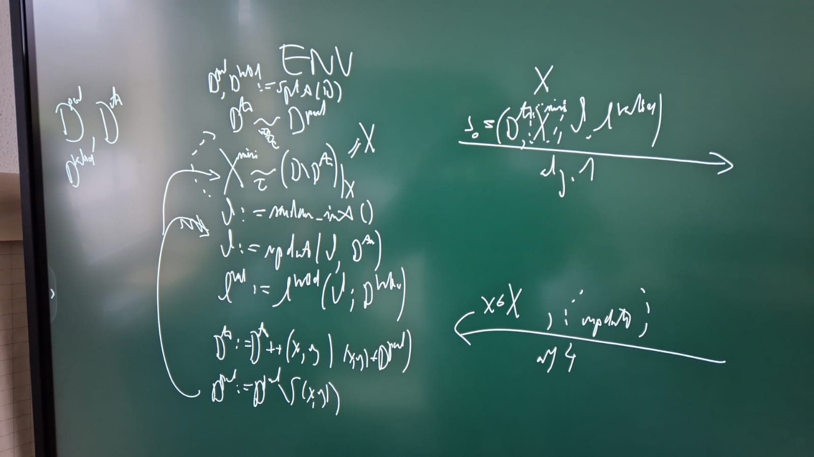

# Implementing Baselines
- TypiClust
- Learning Loss for Active Learning ([Link](https://openaccess.thecvf.com/content_CVPR_2019/papers/Yoo_Learning_Loss_for_Active_Learning_CVPR_2019_paper.pdf))
- Learning to Sample ([Link](https://arxiv.org/pdf/1909.03585.pdf))

# Setting the Budget
When should we stop the experiment? \
When
- oracle/random archives 95%/98% of the oracle performance ?
- until "convergence"?
- 

# Planting Non-Reducable Noise in the Data
A good AL algorithm should be able to distinguish data-noise from model-noise that stems from underfitting and needs to focus on the model-noise and ignore the data-noise.

# Postprocessing
- AL Eval: Towards Robust Reprocudible Active Learning Using Neural Networks
- TypiClust Code (unsupervised embeddings, retraining the embeddings)
- TypiClust Oracle
- Rework the Pseudocode
  - 
- ToyData Surrogate Agent
- GPU Env for Surrogate Agent
- Active Few Shot Learning (Split classes into train classes and testing classes)
- 
